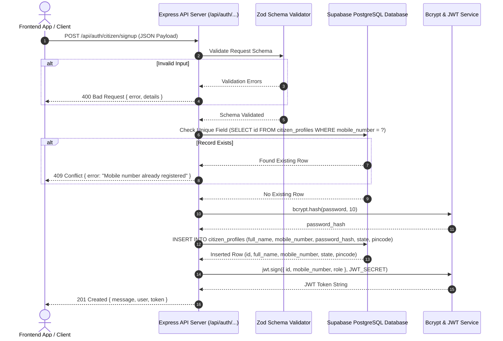

# Express + Supabase + Bcrypt + JWT Authentication API Implementation Guide

This reference guide documents the end-to-end architecture, step-by-step implementation, validation logic, database integration, and testing strategy for creating role-based authentication API endpoints. Use this blueprint for building similar backend endpoints (e.g. Login, Admin Signup, Enumerator Signup).

---

## 1. Overall System Architecture



---

## 2. Environment Configuration (`.env`)

Ensure the backend server has the following environment variables:

```env
EXPO_PUBLIC_SUPABASE_URL=https://<your-project-ref>.supabase.co
EXPO_PUBLIC_SUPABASE_PUBLISHABLE_KEY=<your-anon-key>
SUPABASE_SERVICE_ROLE_KEY=<your-service-role-key>
SUPABASE_URL=https://<your-project-ref>.supabase.co

JWT_SECRET=super_secret_sentinels_jwt_key_2026
JWT_EXPIRES_IN=7d
PORT=8080
EXPO_PUBLIC_API_URL=http://10.0.2.2:8080
```

---

## 3. Complete Server Code Base

### File 1: `src/server/routes/authRoutes.ts`
*(Handles Zod validation, Supabase check, Bcrypt hashing, DB insert, and JWT signing)*

```typescript
import { Router, Request, Response } from 'express';
import bcrypt from 'bcrypt';
import jwt from 'jsonwebtoken';
import { z } from 'zod';
import { createClient } from '@supabase/supabase-js';
import dotenv from 'dotenv';

dotenv.config();

const router = Router();

// Initialize Supabase client using Service Role Key to bypass RLS policies on backend
const supabaseUrl = process.env.EXPO_PUBLIC_SUPABASE_URL || process.env.SUPABASE_URL || '';
const supabaseKey = process.env.SUPABASE_SERVICE_ROLE_KEY || process.env.EXPO_PUBLIC_SUPABASE_PUBLISHABLE_KEY || '';

const supabase = createClient(supabaseUrl, supabaseKey);

const JWT_SECRET = process.env.JWT_SECRET || 'fallback_jwt_secret_key_2026';
const JWT_EXPIRES_IN = process.env.JWT_EXPIRES_IN || '7d';

// Define Zod Validation Schema
const citizenSignupSchema = z.object({
  full_name: z.string().min(1, 'Full name is required'),
  mobile_number: z.string().regex(/^[0-9]{10}$/, 'Mobile number must be a 10-digit number'),
  password: z.string().min(6, 'Password must be at least 6 characters long'),
  state: z.string().min(1, 'State is required'),
  pincode: z.string().regex(/^[0-9]{6}$/, 'Pincode must be a 6-digit number'),
});

/**
 * POST /api/auth/citizen/signup
 * Endpoint to register a new Citizen profile
 */
router.post('/citizen/signup', async (req: Request, res: Response): Promise<void> => {
  try {
    // Step 1: Input Validation
    const parseResult = citizenSignupSchema.safeParse(req.body);
    if (!parseResult.success) {
      res.status(400).json({
        error: 'Validation failed',
        details: parseResult.error.flatten().fieldErrors,
      });
      return;
    }

    const { full_name, mobile_number, password, state, pincode } = parseResult.data;

    // Step 2: Uniqueness Check
    const { data: existingUser, error: checkError } = await supabase
      .from('citizen_profiles')
      .select('id')
      .eq('mobile_number', mobile_number.trim())
      .maybeSingle();

    if (checkError) {
      console.error('[Signup Check Error]:', checkError);
      res.status(500).json({ error: 'Database check failed' });
      return;
    }

    if (existingUser) {
      res.status(409).json({ error: 'Mobile number already registered' });
      return;
    }

    // Step 3: Password Hashing
    const saltRounds = 10;
    const password_hash = await bcrypt.hash(password, saltRounds);

    // Step 4: Supabase PostgreSQL Insert
    const { data: insertedUser, error: insertError } = await supabase
      .from('citizen_profiles')
      .insert({
        full_name: full_name.trim(),
        mobile_number: mobile_number.trim(),
        password_hash,
        state: state.trim(),
        pincode: pincode.trim(),
      })
      .select('id, full_name, mobile_number, state, pincode')
      .single();

    if (insertError || !insertedUser) {
      console.error('[Signup Insert Error]:', insertError);
      res.status(500).json({ error: 'Failed to create citizen profile' });
      return;
    }

    // Step 5: JWT Generation
    const token = jwt.sign(
      {
        id: insertedUser.id,
        mobile_number: insertedUser.mobile_number,
        role: 'citizen',
      },
      JWT_SECRET,
      { expiresIn: JWT_EXPIRES_IN as jwt.SignOptions['expiresIn'] }
    );

    // Step 6: Return Response
    res.status(201).json({
      message: 'Citizen registered successfully',
      user: {
        id: insertedUser.id,
        full_name: insertedUser.full_name,
        mobile_number: insertedUser.mobile_number,
        state: insertedUser.state,
        pincode: insertedUser.pincode,
      },
      token,
    });
  } catch (err: any) {
    console.error('[Citizen Signup Error]:', err);
    res.status(500).json({ error: 'Internal server error' });
  }
});

export default router;
```

---

### File 2: `src/server/index.ts`
*(Main Express server entrypoint)*

```typescript
import express from 'express';
import cors from 'cors';
import dotenv from 'dotenv';
import authRoutes from './routes/authRoutes';

dotenv.config();

const app = express();
const PORT = process.env.PORT || 5000;

// Middlewares
app.use(cors());
app.use(express.json());

// Mount API Routes
app.use('/api/auth', authRoutes);

// Health Check
app.get('/health', (_req, res) => {
  res.json({ status: 'ok', timestamp: new Date().toISOString() });
});

// Start listening if run directly
if (require.main === module) {
  app.listen(PORT, () => {
    console.log(`Server listening on http://localhost:${PORT}`);
  });
}

export default app;
```

---

### File 3: Client Integration (`src/features/auth/authService.ts`)
*(Client-side function to trigger the API from React Native / Expo)*

```typescript
export interface CitizenRegisterData {
  fullName: string;
  mobile: string;
  password: string;
  state: string;
  district: string;
  pinCode: string;
}

export async function registerCitizen(data: CitizenRegisterData) {
  const apiUrl = process.env.EXPO_PUBLIC_API_URL || 'http://localhost:8080';

  const response = await fetch(`${apiUrl}/api/auth/citizen/signup`, {
    method: 'POST',
    headers: {
      'Content-Type': 'application/json',
    },
    body: JSON.stringify({
      full_name: data.fullName,
      mobile_number: data.mobile,
      password: data.password,
      state: data.state,
      pincode: data.pinCode,
    }),
  });

  const resData = await response.json();

  if (!response.ok) {
    throw new Error(resData.error || (resData.details ? JSON.stringify(resData.details) : 'Registration failed'));
  }

  return resData; // Contains { message, user, token }
}
```

---

## 4. API Request & Response Examples

### HTTP Request
```http
POST /api/auth/citizen/signup HTTP/1.1
Host: localhost:5000
Content-Type: application/json

{
  "full_name": "Rahul Kumar",
  "mobile_number": "9876543210",
  "password": "StrongPassword123",
  "state": "Uttar Pradesh",
  "pincode": "201001"
}
```

### HTTP Response (201 Created)
```json
{
  "message": "Citizen registered successfully",
  "user": {
    "id": "37d0f33a-c070-4691-ae83-55fd25664da3",
    "full_name": "Rahul Kumar",
    "mobile_number": "9876543210",
    "state": "Uttar Pradesh",
    "pincode": "201001"
  },
  "token": "eyJhbGciOiJIUzI1NiIsInR5cCI6IkpXVCJ9..."
}
```

### Error Responses
- **400 Bad Request** (Invalid Payload):
  ```json
  {
    "error": "Validation failed",
    "details": {
      "mobile_number": ["Mobile number must be a 10-digit number"]
    }
  }
  ```
- **409 Conflict** (Duplicate Mobile):
  ```json
  {
    "error": "Mobile number already registered"
  }
  ```

---

## 5. How to Reuse for Other Roles or APIs

When creating another endpoint (e.g. `POST /api/auth/admin/signup` or `POST /api/auth/citizen/login`):

1. **Define Schema**: Create a Zod schema matching required input fields.
2. **Query Table**: Change table name in Supabase (`.from('admin_profiles')` or `.from('enumerator_profiles')`).
3. **Password Verification (for Login)**:
   - Use `bcrypt.compare(password, user.password_hash)` to verify credentials.
4. **JWT Payload**: Set claims relevant to that role (e.g., `{ id, role: 'admin' }`).

---

## 6. Troubleshooting & Common Pitfalls

### Issue 1: `TypeError: Network request failed` on Android Emulator
- **Cause**: Using `http://localhost:5000` inside an Android Emulator tries to connect to the emulator device itself rather than your Mac host machine.
- **Fix**: Set `EXPO_PUBLIC_API_URL=http://10.0.2.2:8080` in `.env` (`10.0.2.2` is Android's special alias for the host Mac). Re-run `npx expo start -c`.

### Issue 2: `403 Forbidden` from AirTunes / ControlCenter on Ports 5000/5001
- **Cause**: On macOS Monterey+, **macOS AirPlay Receiver (ControlCenter)** binds to both port `5000` and `5001` by default. Requests to those ports hit AirPlay instead of your Express server.
- **Fix**: Change your Express server port to `8080` in `src/server/index.ts` and `.env` (`PORT=8080` and `EXPO_PUBLIC_API_URL=http://10.0.2.2:8080`).

### Issue 3: `SyntaxError: JSON Parse error: Unexpected end of input`
- **Cause**: Client calls `response.json()`, but the server returned an empty body or HTML error response (e.g. 403 or 404).
- **Fix**: In client fetch methods (e.g. `authService.ts`), read `response.text()` first, safely attempt `JSON.parse()`, and throw a descriptive error message including the HTTP status code if parsing fails.

### Issue 4: `npm run server` Exits Immediately
- **Cause**: Synchronous script runner in CLI mode finishing before asynchronous HTTP listeners keep the process active.
- **Fix**: Use `npx tsx src/server/index.ts` in `package.json` and add `setInterval(() => {}, 10000)` in `src/server/index.ts` to keep Node's event loop active.
